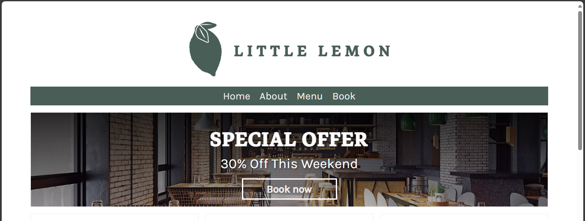
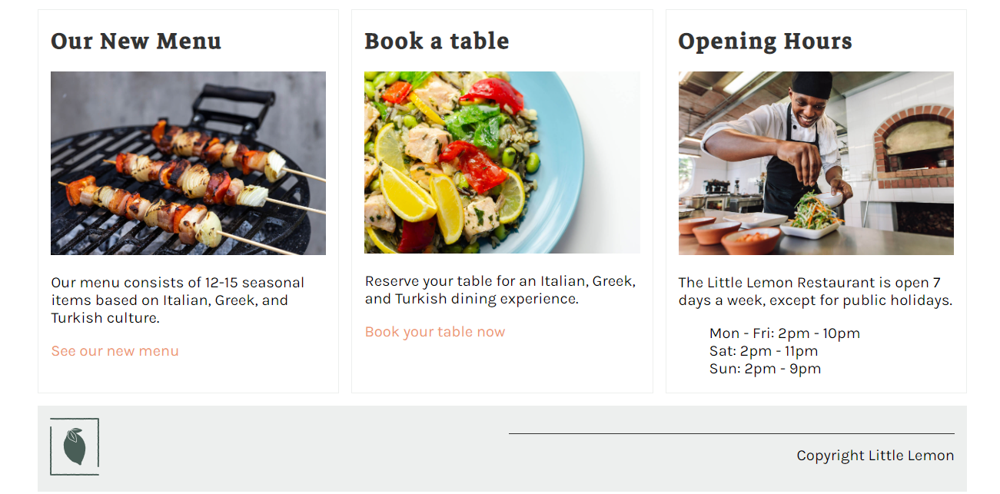
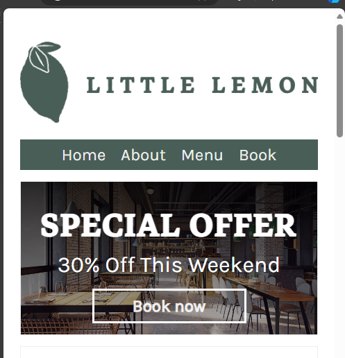
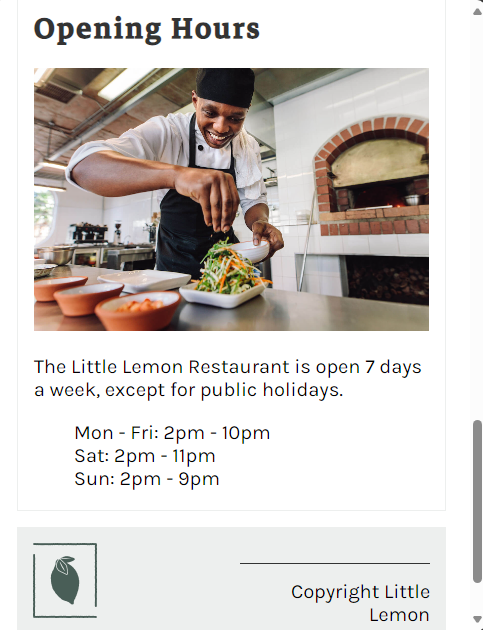
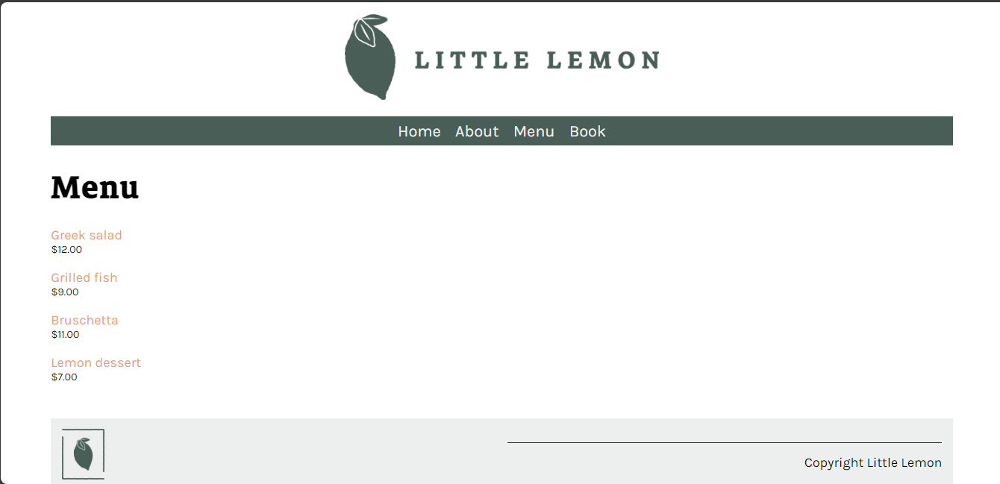
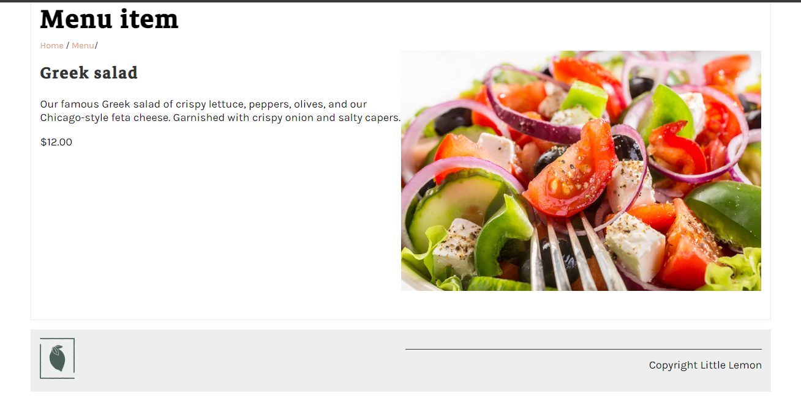

# Little Lemon Restaurant Website

This project serves as the final graded assignment for the Django Web Framework course, part of the Meta Backend Developer Professional Certificate. The website demonstrates core Django proficiency, including MVT architecture, database management, and administrative content control.

## Project Overview
The goal of this project was to develop a functional website for the Little Lemon restaurant. Users can navigate through the site to explore the restaurant's offerings, view the menu, and manage reservations through an intuitive interface.

## Project Functionality
* Homepage: Main navigation landing page.

* Menu Page: Lists all menu items retrieved from the database, sorted alphabetically.

* Menu Item Details: Clicking any menu item opens a dedicated page displaying full details (Name, Price, Description, Image).
* Reservation System: A functional booking page to handle user reservations.

* Admin Interface: Full utilization of Django Admin for managing menu content and database entries.
* UI/UX: Includes a consistent footer across all pages.

## Technologies Used
* Backend: Django (MVT architecture, ORM, Admin Interface).
* Database: SQLite.
* Frontend: HTML5 and CSS3.

## Project Structure
* littlelemon/: Contains project-level configurations (settings.py, urls.py).
* restaurant/: The main application containing:
    * models.py: Defines MenuItem and Booking models.
    * views.py: Logic for menu display, detail views, and reservations.
    * templates/: HTML templates (including base.html with footer).
    * static/: Contains CSS files.

## Setup Instructions
To run this project on your local machine:

1. Clone the repository.
2. Set up the virtual environment:
   python -m venv venv
   source venv/bin/activate  # On Windows use: venv\Scripts\activate
3. Install dependencies:
   pip install -r requirements.txt
4. Apply migrations and run the server:
   python manage.py migrate
   python manage.py runserver
5. Accessing the Application:
   - Admin: Create a superuser via 'python manage.py createsuperuser' and access http://127.0.0.1:8000/admin to add menu items.
   - Public Site: Visit http://127.0.0.1:8000/ to navigate the site.
